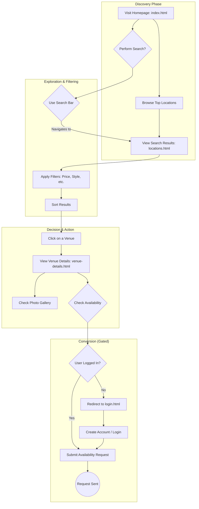
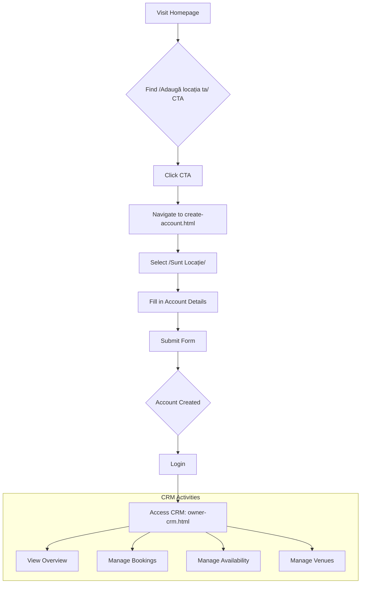
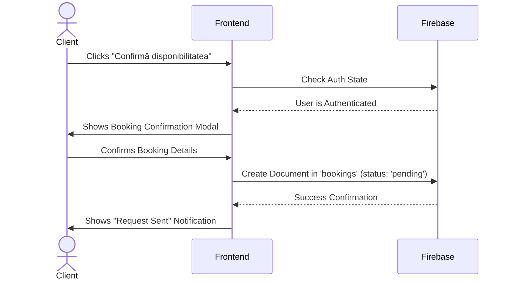
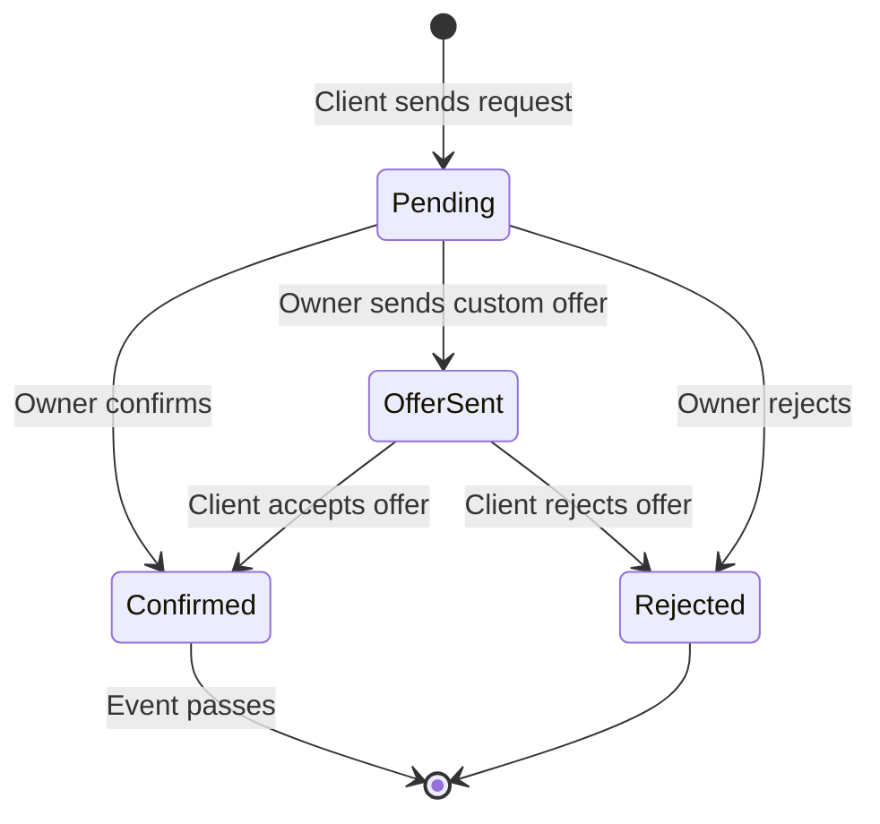
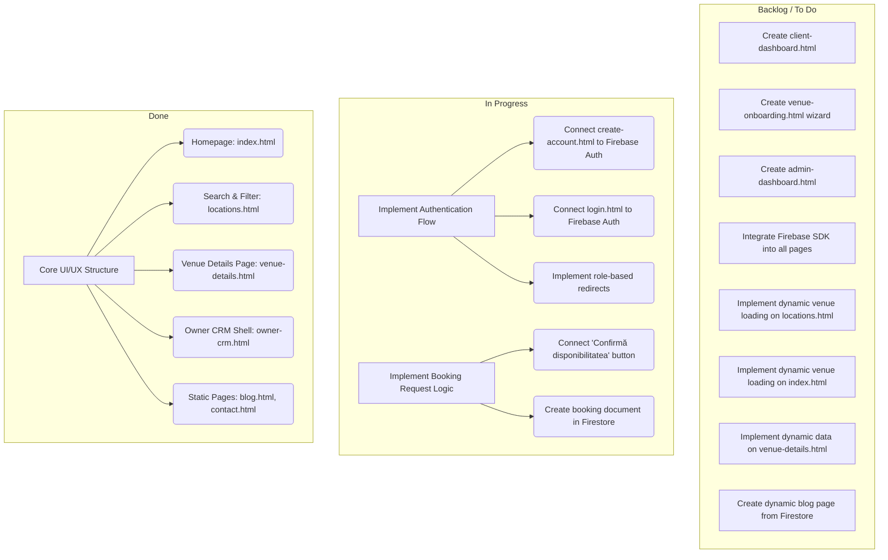

# OuidoEvents: User Journey & Implementation Plan

## 1. User Journeys and Experience (UX) - Detailed Analysis

This analysis breaks down the user experience on a page-by-page, component-by-component basis, focusing on the journey of the primary personas.

### Shared Components

*   **`header.html`**: The header provides consistent navigation.
    *   **Logo (`OuidoEvents`)**: Acts as a reliable "home" button.
    *   **Navigation Links (`Locații`, `Blog`, `Despre noi`, `Contact`)**: Clear, standard navigation for exploring the site's main sections.
    *   **Role Switcher**: A dropdown to switch between "Client", "Owner", and "Admin" roles. This is a developer-facing tool at this stage and hints at the multi-persona nature of the platform. For a real user, this would be absent, as roles are determined by their account.
    *   **CTAs (`Conectare`, `Adaugă locația ta`)**: Clear, action-oriented buttons. The primary CTA (`Adaugă locația ta`) is visually distinct, correctly guiding potential venue owners.
*   **`footer.html`**: Contains standard footer links, reinforcing trust and providing access to secondary information.
*   **`mobile-menu.html`**: Ensures a good experience on mobile by providing a slide-out panel with all the necessary navigation links and actions from the header.

### Persona 1: The Client (Event Organizer)

The client's goal is to find and book a venue with confidence and ease.

#### **Visual Journey Flowchart**



#### **Page-by-Page Analysis**

*   **`index.html` (Homepage)**
    *   **Initial Impression**: The user is greeted with a clear, aspirational headline: "**Găsește locația perfectă pentru evenimentul tău**". The sub-headline specifies the event types, immediately confirming the site's purpose.
    *   **`search-box.html`**: This is the central focus.
        *   **Labels (`Tipul evenimentului`, `Locația`, `Data evenimentului`, `Invitați`)**: The labels are clear and guide the user on what information to provide.
        *   **Inputs**:
            *   `Tipul evenimentului`: A `<select>` dropdown with logical options (`Nuntă`, `Botez`, etc.). This is a good UX choice as it constrains options and prevents typos.
            *   `Locația`: A text input with placeholder text "Oraș sau județ", which is clear.
            *   `Data evenimentului`: A text input that will be enhanced by `flatpickr` for a modern date selection experience.
            *   `Invitați`: A `<select>` dropdown with ranges, which is much better than a simple number input for an initial search.
        *   **Button (`Caută`)**: A large, clearly labeled button. The `data-search-navigate-to="locations.html"` attribute indicates a well-planned flow: a search on the homepage takes you to the dedicated results page.
    *   **`#top-locations` Section**:
        *   **Headline (`Locații de Top Recomandate`)**: Builds trust by suggesting curation.
        *   **Venue Cards**: Each card is a well-structured summary:
            *   `result-image`: A placeholder for a visually appealing photo.
            *   `result-tags`: Small, colored tags like "Exclusivist" give a quick sense of the venue's character.
            *   `result-name` & `result-location`: Clearly displayed.
            *   `result-meta`: An icon with guest capacity provides critical information at a glance.
            *   `result-info`: Shows the starting price ("de la **120€**/pers") and a clear CTA button "**Vezi detalii**". This is excellent for qualifying leads.
    *   **Informational Sections (`Why Choose Us`, `How It Works`)**: These sections use clear headings, icons, and short descriptions to build trust and explain the value proposition without overwhelming the user.
    *   **Testimonials Section**: The slider with quotes and author names adds social proof, a crucial element for a high-stakes decision like booking a venue. The carousel controls (`prev`/`next`) are standard and intuitive.
    *   **Final CTA (`Doriți să vă promovați locația?`)**: A clear call-to-action for the second persona (venue owner), ensuring the homepage serves both primary user types.

*   **`locations.html` (Search Results)**
    *   **Experience**: This page is the core of the search experience.
    *   **Filters (Left Sidebar)**:
        *   The filters are grouped into `<details>` elements, which is a smart way to keep the UI clean while providing powerful options. They are open by default, which is good for discoverability.
        *   **Buget**: A range slider is an intuitive way to set a price limit. The live-updating `price-value` span is a great micro-interaction.
        *   **Capacitate Invitați**: A number input for precise needs.
        *   **Rating**: Radio buttons for minimum rating provide a clear way to filter by quality.
        *   **Stil & Facilități**: Long lists of checkboxes that allow for very specific filtering.
    *   **Main Content (Right Side)**:
        *   **Sort Bar**: A dropdown to sort results by "Recomandate", "Preț", "Rating", and "Capacitate" gives the user control over the display order.
        *   **Location List**: The venue cards here are slightly different from the homepage. They are in a list view, showing more information.
            *   **Favorite Button**: A heart icon on each card allows users to save venues. The `is-favorite` class suggests a toggle state. This is a key feature for comparison.
            *   **Rating Display**: A numerical badge (`9.4`) with a descriptive text (`Superb`) and review count adds more detail than the homepage cards.
            *   **CTA (`Vezi disponibilitatea`)**: This is a more specific CTA than "Vezi detalii", directly addressing the user's next logical step.

*   **`venue-details.html` (Venue Profile)**
    *   **Experience**: This page is designed to give the client all the information they need to make a decision.
    *   **Hero Section**:
        *   **Breadcrumbs**: Helps with orientation and navigation.
        *   **Venue Name & Favorite Button**: Consistent with the `locations.html` page.
        *   **Tags & Description**: Provide a quick summary and a more detailed narrative.
    *   **Gallery Section**:
        *   A sophisticated grid layout with a main image and smaller thumbnails.
        *   The "Vezi toate fotografiile" button on the last image is a standard and effective pattern for launching a full gallery view (lightbox).
        *   The lightbox itself has previous/next controls and can be closed easily, which is good UX.
    *   **Left Column (Details)**:
        *   **`Despre această locație`**: A long-form description.
        *   **`Detalii Eveniment`**: Key facts (capacity, rating) are repeated here for reinforcement, using clear icons.
        *   **`Stiluri și Teme` & `Facilități disponibile`**: Comprehensive lists with checkmark icons provide a scannable overview of what the venue offers.
    *   **Right Column (Action Widget)**:
        *   This is a "sticky" element, meaning it stays in view as the user scrolls. This is a great design choice as it keeps the main call-to-action always accessible.
        *   **`Disponibilitate și pre-rezervare`**: The headline sets a clear expectation.
        *   **Calendar Placeholder**: This is the main point of interaction.
        *   **Price Display**: The price is shown again, which is important for transparency.
        *   **CTA (`Confirmă disponibilitatea`)**: This is the primary action button.
        *   **Widget Note**: The small text below the button, "După confirmarea disponibilității, proprietarul va putea aproba pre-rezervarea ta," is crucial for managing user expectations about the process.
    *   **Contact Section**:
        *   Initially, the contact details are hidden behind a login wall ("Pentru a vizualiza detaliile de contact, te rugăm să te autentifici."). This is a business decision to drive user sign-ups.
        *   The `setTimeout` to reveal the contact info after 2 seconds is an interesting UX choice, perhaps to encourage sign-up but not completely block the user.

*   **`create-account.html` & `login.html`**
    *   **Experience**: Standard, clean forms for authentication.
    *   **`create-account.html`**:
        *   **Account Type Radio Buttons (`Sunt Client` / `Sunt Locație`)**: This is the most critical element on the page. It's well-designed with large, clickable labels, making the choice clear.
        *   The form fields are standard and clearly labeled.
        *   The link to the login page ("Ai deja cont? Autentifică-te") is a standard and necessary feature.
    *   **`login.html`**:
        *   A simple form. The "Ai uitat parola?" link is present, which is essential.

### Persona 2: The Venue Owner

The owner's goal is to manage their listings and bookings efficiently.

#### **Visual Journey Flowchart**



#### **Page-by-Page Analysis**

*   **`owner-crm.html` (Owner Dashboard)**
    *   **Experience**: This is a data-rich, application-like interface designed for power users.
    *   **Sidebar Navigation**:
        *   The navigation is grouped into logical sections ("Panou general", "Gestionare operațională", "Comunicare & control").
        *   Each link has an icon and a clear label. The `is-active` state is visually distinct. This is excellent for orientation within a complex single-page app.
    *   **Overview Page (`data-page="overview"`)**:
        *   **Metrics Grid**: The four cards at the top provide a high-level summary of the most important numbers (bookings, pending requests, viewings, availability). The use of trend indicators ("+3 vs luna trecută") is very effective.
        *   **Lists (`Flux rapid bookings`, `Programări vizionări`, `Evenimente confirmate`)**: These lists provide a quick look at the most recent and relevant activities. The items are clickable, suggesting the user can navigate to the details.
        *   **Charts**: The occupancy chart, event type distribution, and viewings status charts provide a visual representation of the business's health, which is much easier to digest than raw numbers.
    *   **Bookings Page (`data-page="bookings"`)**:
        *   **Status Summary**: The metrics grid is reused here to show the count for each booking status, which is a great way to see the pipeline at a glance.
        *   **Legend**: The status legend clearly explains what each status color/label means.
        *   **Filters**: The ability to filter the main table by venue and status is essential for owners with multiple properties.
        *   **Table**: The table is the core of this page. It shows all the key information for each booking. The "Acțiuni rapide" column with buttons like "Vezi detalii" and "Confirma disponibilitatea" allows the owner to take action directly from the list.
    *   **Other Pages (`viewings`, `availability`, `venues`, etc.)**:
        *   These pages follow the same pattern: a clear header, filters where appropriate, and a data table or grid to display and manage information.
        *   The `availability` page with its weekly calendar matrix is a particularly strong and intuitive UI for managing schedules.
        *   The `settings` page provides granular control over notifications and workflows, which is a sign of a mature product design.

### Persona 3: The Administrator

*   **Experience**: As noted before, this journey is entirely undefined. The only hint is the "Admin" option in the `header.html` role switcher. The experience would need to be designed from scratch, likely following the pattern of the `owner-crm.html` but with a higher level of access and control over all users and venues.

### System Interaction Diagrams

#### **Booking Request Sequence Diagram**

This diagram shows how the components interact when a logged-in client requests to book a venue.



#### **Booking Status State Diagram**

This diagram illustrates the lifecycle of a booking from the system's perspective.



## 2. Missing Interface Elements

To create a complete and functional product, the following interfaces need to be built.

1.  **Client Dashboard:**
    *   A dedicated page for logged-in clients.
    *   **My Bookings:** A list of all their availability requests with their current status (Pending, Confirmed, Offer Sent, Declined).
    *   **My Favorites:** A page displaying all the venues they have marked as favorites.
    *   **Inbox:** A messaging interface to communicate with venue owners.
    *   **Profile Settings:** To manage their personal information.

2.  **Venue Onboarding/Creation Flow:**
    *   After a venue owner creates an account, they should be guided through a multi-step process to add their first venue. This could be a wizard-style form that collects:
        *   Basic information (name, address, description).
        *   Photos (with an upload interface).
        *   Details (capacity, price per person).
        *   Facilities, styles, and event types (using checkboxes).
        *   Initial availability.

3.  **Admin Dashboard:**
    *   A comprehensive backend interface for platform management.
    *   **User Management:** View, edit, and manage all users (both clients and owners).
    *   **Venue Management:** Review and approve/reject new venue submissions. Edit existing venue listings.
    *   **Bookings Overview:** See all bookings across the platform.
    *   **Blog Management:** A CRUD (Create, Read, Update, Delete) interface for blog posts.
    *   **Platform Analytics:** High-level statistics on users, bookings, and revenue.

## 3. Firebase Implementation Walkthrough

Firebase is an excellent choice for the backend, providing authentication, a real-time database, storage, and serverless functions.

### A. Firebase Setup

1.  Create a new project in the [Firebase Console](https://console.firebase.google.com/).
2.  Add a new Web App to your project.
3.  Copy the Firebase configuration object and save it. You will use this in your `main.js`.

### B. Database/Dataset Structure (Firestore)

Firestore is a NoSQL, document-oriented database. Here is a recommended structure:

```
/users/{userId}
  - email: "client@email.com"
  - firstName: "Ion"
  - lastName: "Popescu"
  - role: "client" // or "owner" or "admin"
  - favorites: ["venueId1", "venueId2"] // For clients

/venues/{venueId}
  - ownerId: "userIdOfOwner"
  - name: "The Grand Ballroom"
  - city: "București"
  - address: "..."
  - description: "..."
  - price: 120
  - capacity_min: 150
  - capacity_max: 400
  - tags: ["Exclusivist", "Panoramic"]
  - facilities: ["Parcare", "Wi-Fi gratuit"]
  - imageUrls: ["url1", "url2"]
  - status: "approved" // or "pending", "rejected"
  - averageRating: 9.4

/bookings/{bookingId}
  - clientId: "userIdOfClient"
  - venueId: "venueId"
  - ownerId: "userIdOfOwner"
  - eventType: "Nuntă"
  - eventDate: "2025-10-25"
  - guests: 150
  - status: "pending" // pending, confirmed, rejected, offer_sent
  - createdAt: timestamp

/reviews/{reviewId}
  - venueId: "venueId"
  - clientId: "userIdOfClient"
  - rating: 5
  - comment: "A fost o experienta minunata!"
  - createdAt: timestamp
```

### C. Code Patterns & Implementation Steps

You will need to include the Firebase SDKs in your project. You can add these to your `index.html` or other relevant files.

**1. Authentication (in `main.js` or a dedicated `auth.js`)**

*   **Create Account (`create-account.html`):**
    *   Add an event listener to the form submission.
    *   Use `firebase.auth().createUserWithEmailAndPassword(email, password)`.
    *   In the `.then()` block, get the `user` object. Call a Cloud Function to create a corresponding user document in Firestore (`/users/{userId}`) with the selected role.

    ```javascript
    // In your form submit listener
    const email = document.getElementById('email').value;
    const password = document.getElementById('password').value;
    const accountType = document.querySelector('input[name="account-type"]:checked').value;

    firebase.auth().createUserWithEmailAndPassword(email, password)
      .then((userCredential) => {
        // User created. Now create user profile in Firestore.
        const user = userCredential.user;
        const createUserProfile = firebase.functions().httpsCallable('createUserProfile');
        return createUserProfile({
          userId: user.uid,
          email: user.email,
          firstName: document.getElementById('first-name').value,
          lastName: document.getElementById('last-name').value,
          role: accountType
        });
      })
      .then(() => {
        // Redirect to the correct dashboard
        if (accountType === 'venue') {
          window.location.href = 'owner-crm.html'; // Or a new venue onboarding page
        } else {
          window.location.href = 'client-dashboard.html'; // The new client dashboard
        }
      })
      .catch((error) => {
        console.error("Error creating account: ", error);
      });
    ```

*   **Login (`login.html`):**
    *   Use `firebase.auth().signInWithEmailAndPassword(email, password)`.
    *   On success, redirect the user based on their role (which you can fetch from their Firestore document).

**2. Displaying Venues (in `locations.js`)**

*   Fetch venues from Firestore to populate the `locations.html` page.

    ```javascript
    const db = firebase.firestore();
    const locationsContainer = document.getElementById('locations-list');

    db.collection("venues").where("status", "==", "approved").get().then((querySnapshot) => {
      querySnapshot.forEach((doc) => {
        const venue = doc.data();
        const venueCard = `<!-- HTML for a venue card, populated with venue data -->`;
        locationsContainer.innerHTML += venueCard;
      });
    });
    ```

**3. Handling Bookings (`venue-details.html`)**

*   When a client clicks "Confirmă disponibilitatea":
    *   Check if the user is logged in. If not, redirect to `login.html`.
    *   If logged in, open a modal or show a form to confirm the booking request details.
    *   On submission, create a new document in the `/bookings` collection in Firestore with `status: "pending"`.

    ```javascript
    // On "Confirmă disponibilitatea" button click
    const currentUser = firebase.auth().currentUser;
    if (!currentUser) {
      window.location.href = 'login.html';
      return;
    }

    // Assuming you get the date from a calendar input
    const eventDate = document.getElementById('event-date-picker').value;

    db.collection("bookings").add({
      clientId: currentUser.uid,
      venueId: "the_current_venue_id", // Get this from the page
      ownerId: "the_venue_owner_id", // This should be on the venue document
      eventDate: eventDate,
      status: "pending",
      createdAt: firebase.firestore.FieldValue.serverTimestamp()
    })
    .then(() => {
      alert("Cererea ta a fost trimisă! Vei fi notificat când proprietarul răspunde.");
    });
    ```

**4. Owner CRM (`owner-crm.js`)**

*   This page will heavily rely on Firestore's real-time capabilities.
*   Use `onSnapshot` listeners to get real-time updates for bookings, viewings, etc.

    ```javascript
    // Listen for new bookings for the current owner
    const currentUser = firebase.auth().currentUser;
    if (currentUser) {
      db.collection("bookings").where("ownerId", "==", currentUser.uid)
        .onSnapshot((querySnapshot) => {
          const bookings = [];
          querySnapshot.forEach((doc) => {
            bookings.push({ id: doc.id, ...doc.data() });
          });
          // Call a function to render the bookings table with the new data
          renderBookingsTable(bookings);
        });
    }
    ```

*   **Updating a Booking Status:**
    *   When an owner clicks an action button (e.g., "Confirm"):
    *   Use `db.collection("bookings").doc(bookingId).update({ status: "confirmed" });`

This implementation plan provides a solid foundation for building a fully functional venue marketplace using your existing frontend and Firebase. The next steps would be to create the missing HTML files (`client-dashboard.html`, `admin.html`, venue onboarding) and write the JavaScript to connect everything to Firebase.

## 4. Frontend Development Kanban Board

This board outlines the necessary tasks to complete the frontend development and connect it to a Firebase backend.


